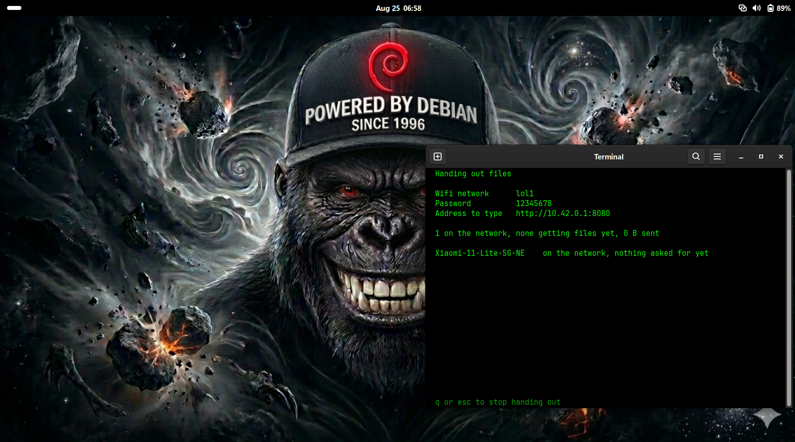
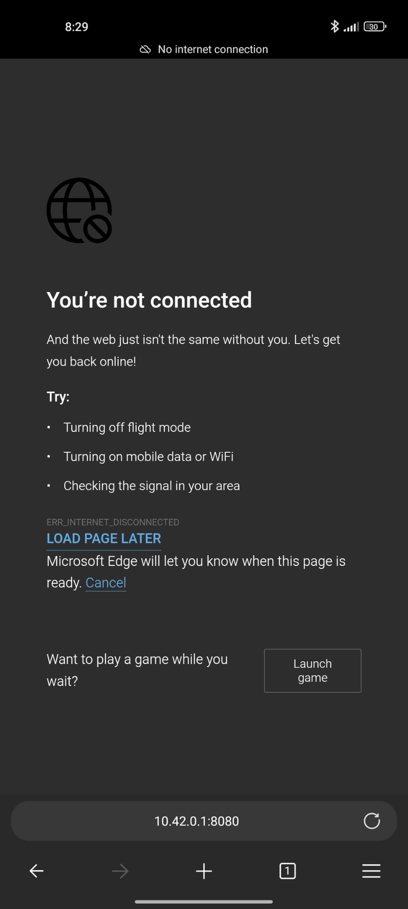
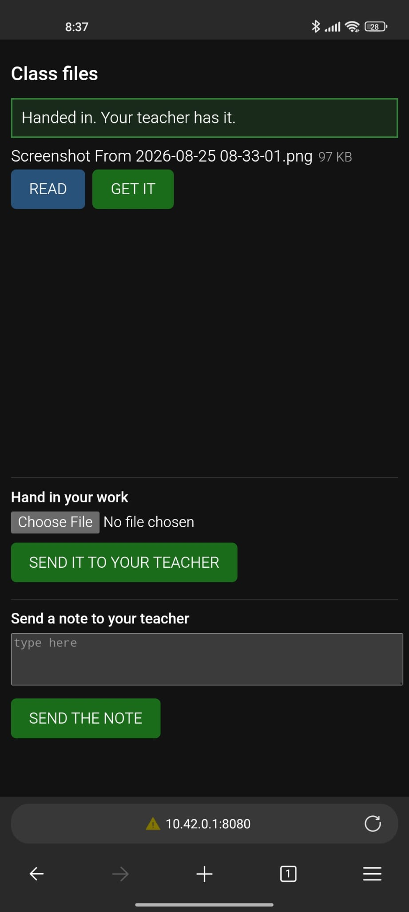
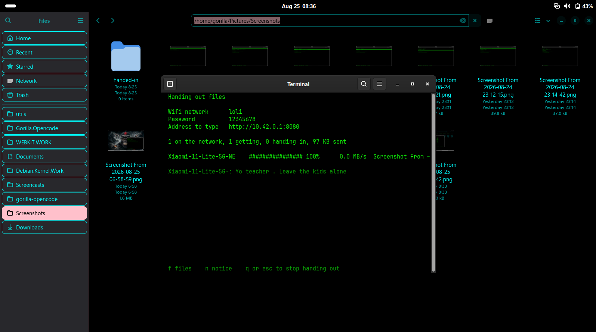
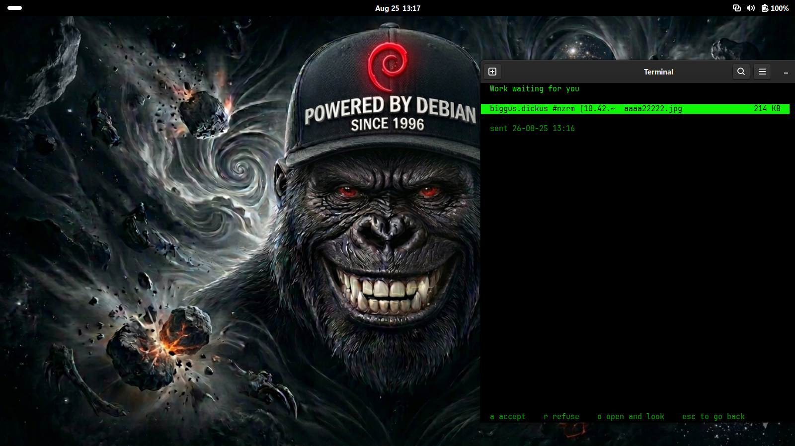
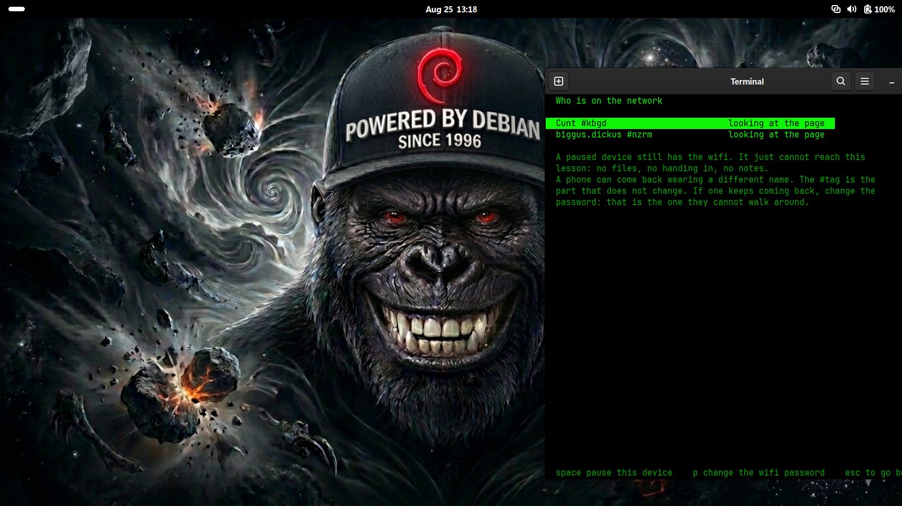
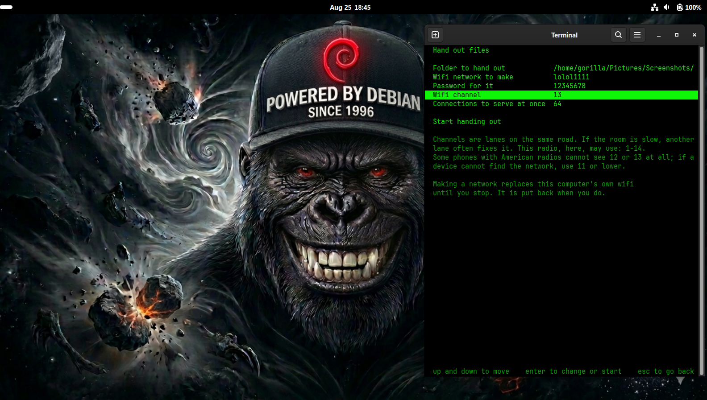
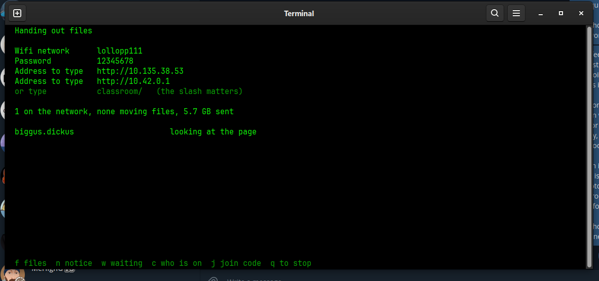

<!-- Version: 1.5.0 · updated 26-08-25-18-58 -->
# Gorilla Portable Network Hub

<!-- WHO-THIS-IS-FOR: managed block, do not edit by hand -->

**Turn a laptop into the network: hand a folder to every device in the room, with no internet and no router.**

Built for the people every other tool prices out: kids with no credit
card, 15-year-old laptops, data sold by the megabyte. Free forever, by
design, not as a trial.
Why, with the numbers: [PHILOSOPHY.md](https://github.com/gorillanobakaa-dot/Gorilla.Opencode/blob/main/PHILOSOPHY.md)

<!-- /WHO-THIS-IS-FOR -->

A laptop that **creates a network where none exists**, and hands a folder to
every device in the room. The children's machines need no app, no account, no
privileges and no internet, ever: a browser from 2009 is enough. Nothing here
phones home, checks a licence, or expires.

Run `hub` with no arguments and it opens the screen. That is the way in for
anybody who is not the person who wrote it.

[](docs/screenshots/gallery/hero-desktop-with-live-roster.png)

---

## The story, told by the screens it happened on

Everything below is a real screenshot from the field days of 25 August 2026:
one very old laptop being the entire network, one plain unmodified Windows
laptop and one Xiaomi phone as the class, browser only, nothing installed on
either. The harshest honest conditions we could assemble, on purpose. This is
what the rooms this is built for actually look like: Kabul, Mogadishu, Goma,
Luanda, or simply a school where the router money never arrived.

### Where it started

[](docs/screenshots/gallery/before-edge-no-internet-error.jpeg)

This is the first thing a real phone said to the first version: *this network
has no internet*, and then nothing. A child at this screen is stuck, and no
child should need to know what an IP address is. The fix became the founding
feature: the hub answers the phone's own "is there internet?" check in a way
that makes the phone itself open the class page, the same trick every hotel
wifi uses, pointed at a lesson instead of a bill.

### What a child sees now

[](docs/screenshots/gallery/phone-handed-in-confirmation.jpeg)

Join the wifi, and the page appears by itself. Big buttons. READ opens a file
right there, GET IT keeps it, *Hand in your work* takes several files at once,
and there is a box to write to the teacher. No app store, no sign-up, no
JavaScript, and it works on browsers back to 2009 because the phones in these
rooms are the phones nobody else wanted.

### The first note ever sent through it

[](docs/screenshots/gallery/roster-live-progress-and-first-note.png)

The first message a real human sent across this thing was *"Yo teacher. Leave
the kids alone."* One word shy of the anthem, which of course leaves *them*
kids alone. It arrived attributed: name, device, and a short tag derived from
the hardware that no child can type their way out of. Thirty identical phones
and a class-clown name policy are assumed from the start, because the tester
assumed them first, forty-six years after somebody first put that sentiment to
a bass line.

### The failure we kept

[](docs/screenshots/gallery/waiting-work-with-the-device-column-empty.png)

An hour after a release, a laptop handed in work and the record showed only a
number where the device should be. Phones announce their names; laptops often
do not, and nothing had ever tested that. The screenshot stays in the gallery
because the fix only makes sense next to what it fixes: the record now asks
the browser, which has been announcing roughly what it is on every request all
along. Every bug this project finds is written up, not buried; the two
explanations that turned out wrong during the speed hunt below are still on
the record too, withdrawn in place.

### The teacher stays in charge

[](docs/screenshots/gallery/class-screen-two-devices-and-the-limits.png)

Pause one device and it keeps the wifi but loses the lesson: no files, no
handing in, no notes, and a page that says so, which un-pauses itself when the
teacher relents. Change the wifi password and the whole room is knocked off at
once. The screen states the limits out loud, because a teacher who believes a
pause is a lock will otherwise be corrected by a child, in front of a class.

### The invisible thief

[](docs/screenshots/gallery/send-form-channel-13-lanes-explained.png)

One evening the same transfer that had run at 7 MB/s ran at 4.7, and every
counter said everything was fine: retries clean, receiver happy, laptop cool.
The thief was the wifi channel, picked automatically, and the proof was
surgical because nobody stopped the download: the network was moved to another
channel **underneath the live transfer**, the stream rode through the gap, and
the same connection immediately ran a third faster. A crowded lane looks fine
from the front of the room; it is just slow. So the teacher got the dial, and
the list of lanes it offers is read from the radio and the country, never
assumed. The full hunt, with every suspect and every number, is in
[bench/RESULTS.md](bench/RESULTS.md).

### The receipt

[](docs/screenshots/gallery/roster-after-5.7gb-none-moving.png)

End of the field day: a 5.7 GB database delivered in one piece to a machine
running nothing but Edge, across a transfer that survived its own network
being re-tuned mid-flight, served by a 2012 laptop that never left 4% CPU.
The screen looking bored is the point.

---

## It runs at 73% of what the radio can physically do

This laptop's wifi is a 1x1 Atheros AR9485 from 2012. Its hardware ceiling,
read from the driver, is **72.2 Mbit/s**. Nothing can go faster than that on
this machine.

| | measured | of the 72.2 Mbit/s ceiling |
|---|---|---|
| **this tool, four connections** | **6.57 MB/s** (52.56 Mbit/s) | **72.8%** |
| this tool, best second | 7.04 MB/s (56.32 Mbit/s) | 78.0% |
| a browser alone, clean channel | 6.07 MB/s (48.6 Mbit/s) | 67.3% |
| speedtest.net over the ISP | 5.36 MB/s (42.86 Mbit/s) | 59.4% |

Textbook TCP efficiency over 802.11n is around 60%, which is what the internet
path gives. Over its own hotspot this tool holds **73%**, sustained. The
ceiling is airtime, not software: the peak is 7.0 MB/s at every connection
count from one to 32, so four is the default for having the best mean and the
lowest variance, not for being fastest.

Full sweeps, the method, and what is NOT proven: [bench/RESULTS.md](bench/RESULTS.md).

**Status: not finished.** What works and is measured: the laptop becomes a
properly configured access point, whole folders move across it either as one
streamed download or file by file with resume and per-piece verification, and
there is a screen to drive it all from. What is unproven: everything involving
thirty devices in one room at once, and the Arch package has never met an Arch
machine.

## Read these in order

| | |
|---|---|
| [bench/RESULTS.md](bench/RESULTS.md) | **the numbers, on one page.** What it achieves, against what the hardware can physically do, and what is NOT proven |
| [docs/HOW-TO.md](docs/HOW-TO.md) | **start here if you want to use it.** Step by step with pictures, written for somebody who has never opened a terminal |
| [docs/WHY-THIS-EXISTS.md](docs/WHY-THIS-EXISTS.md) | the layman track. What the problem is and what was proved, in plain language |
| [docs/DEVELOPER.md](docs/DEVELOPER.md) | the developer track. Architecture, wire format, every measurement with its method |
| [docs/SCREENSHOTS.md](docs/SCREENSHOTS.md) | every screen, photographed on real hardware |
| [bench/](bench/) | the raw research: source reading, measurements, corrections, open questions |

Both tracks are complete. The layman one is a different language, not a
simplification.

## What is here

One binary, `hub`, with a screen and four commands inside it.

```
src/hub/src/tui.rs      the screen a teacher uses: hand out, or go and get
src/hub/src/term.rs     raw mode, size, keys, and a frame that is exactly
                        the height of the terminal
src/hub/src/net.rs      finding the other machine, making the wifi network,
                        and asking the radio which channels are allowed
src/hub/src/serve.rs    HTTP/1.1 with byte ranges and keep-alive
src/hub/src/page.rs     the class page: captive portal, uploads, notes
src/hub/src/zip.rs      the GET EVERYTHING button: a whole folder streamed
                        as one download, never staged, nothing compressed
src/hub/src/qr.rs       the join-by-camera code, drawn without a library
src/hub/src/fetch.rs    parallel, resumable, verifying client
src/hub/src/sums.rs     per-piece SHA-256 across every core
src/hub/src/sha256.rs   142 lines, no dependencies
bench/                  measurements, design notes, corrections
```

Rust, `std` only, **no dependencies at all**, screen included. There is no
terminal-UI library, no HTTP library, no zip library and no QR library in
here: each would have added more to the download than the code that replaced
it.

| | bytes |
|---|---|
| three separate command-line tools | 1,262,576 |
| merged into one binary | 514,480 |
| with the whole screen added | 596,960 |
| **0.8.0, with folders, the streamed archive, the QR code and the channel picker** | **761,224** |
| the same 0.8.0 built for Windows | 653,824 |

On the connections this is for, the whole program is about a minute of
somebody's life. Everything it gained since the first release cost 246,744
bytes.

The access point rig used to take the measurements lives separately in
`Scripts.For.Work/wifi-ap-lab/`, because those are bench instruments rather
than part of the product.

## Installing

Built packages for all three are on the
[releases page](https://github.com/gorillanobakaa-dot/Gorilla.Portable.Network.Hub/releases).
[docs/HOW-TO.md](docs/HOW-TO.md) walks through each one with pictures.

**Debian, Ubuntu, Mint:**

```
sudo dpkg -i gorilla-portable-network-hub_0.8.0_amd64.deb
```

**Arch, CachyOS, Manjaro:**

```
sudo pacman -U gorilla-portable-network-hub-0.8.0-1-x86_64.pkg.tar.zst
```

Or from source with `makepkg -si` in `packaging/`. The Arch package is
assembled to spec and structurally verified on a Debian machine; it has not yet
been installed on an Arch one, and that is exactly the kind of thing worth
telling us about.

**Windows:** unzip `hub-0.8.0-windows-x86_64.zip` and read
`READ-THIS-FIRST.txt`. Windows will not let a normal program create a wifi
network, so you switch the hotspot on in Settings first. Everything else works
the same.

**From this repository:**

```
cd src/hub && cargo build --release && cd ../..
./packaging/build-deb.sh          # or ./packaging/build-arch.sh
sudo dpkg -i packaging/build/gorilla-portable-network-hub_0.8.0_amd64.deb
```

It installs `hub`, a menu entry called **Portable Network Hub**, a man page, and
both documentation tracks under `/usr/share/doc`. Nothing is required at run
time beyond the C library; NetworkManager is only needed to CREATE a wifi
network, not to hand files out over one that already exists.

The icon is rendered at every size from one master rather than one file copied
into nine slots, which is what makes it sharp in a menu instead of grainy. The
build refuses to finish if any two sizes turn out to be the same file.

**One name clash to know about:** Debian already ships a package called `hub`
(GitHub's command-line wrapper), which also owns `/usr/bin/hub`. They cannot be
installed at the same time. dpkg will say so rather than overwrite anything, and
the binary name here is not settled yet.

## How it is used

**Handing out.** Open `hub`, choose *Hand out files to the class*, point it at
a folder (a USB drive is fine, that is what teachers actually carry), tick
which files the class may see, and optionally give the wifi network a name, a
password and a channel. Folders inside the folder are included, exactly as
they sit. It shows the address for the board and one line per device.

**The kids need nothing installed, ever.** A phone or laptop that joins the
wifi is told by its own operating system that something is waiting: the same
"Sign in to this network" screen every hotel wifi uses, and the sign-in screen
IS the class page. Big buttons: READ or PLAY opens a file right there (video
streams instead of filling an 8 GB phone), GET IT keeps a copy, and one purple
**GET EVERYTHING** button takes the whole folder as a single download that
Windows opens like a folder. The page also has *Hand in your work*, which takes
**several files at once** and understands the formats a real curriculum
produces (Word, Excel, PowerPoint, OpenDocument, PDF, Markdown, CSV, zip), and
*Send a note to your teacher*. No addresses typed, no apps, no JavaScript
needed, works in browsers back to 2009.

**Every device says who it is.** Each one is asked its name once, and every
note and every piece of work is filed with that name, the device, and a short
tag derived from the hardware that a child cannot type their way out of. When
two devices claim one name the teacher is told, rather than left to work it
out.

**Nothing lands on the teacher's computer unasked.** Work arrives in a holding
area and waits. She sees who sent it, what it is and how big, and accepts or
refuses without opening anything. A refusal is kept, never deleted. Nothing
sent in is ever handed back out to the class, not even while it waits.

**The teacher stays in charge.** A notice at the top of every kid's page (the
blackboard, duplicated), a tick list that publishes or withdraws a file live
during the lesson, and a roster naming every device: who is getting, who is
handing in, how long is left, and who has not opened the page yet.

**Two ways to remove somebody, and they are not the same.** Pausing a device
leaves it on the wifi and cuts it off from the lesson. Changing the wifi
password knocks the whole room off at once. The screen is honest about the
difference: a pause recognises a device, and a phone can come back wearing a
different name, which is what the password is for.

**Joining by camera, as a bonus and never the way in.** Press `j` and the
screen draws a code a phone camera can read. The network name and password stay
printed underneath at the same size, because plenty of these phones have a
cracked camera or a camera app that wants an account first, and a screen
showing only a code locks those children out invisibly.

**Going and getting, tool to tool.** Open `hub` on a second machine, choose
*Get files from another computer*. It finds the teacher by itself, and one key
takes every file on the list, rebuilding the folder structure, several files
in the air at once, resuming per file if the signal drops.

Everything is still there from the command line, for anybody who prefers it:

```
hub serve ~/lessons --name Classroom --password chalkdust --channel 13
hub get http://10.42.0.1/lessons.zip
hub doctor
```

## Tell us how it went

This has been used in one room, over two field days, by one person. A report
from a second room is worth more than anything that can be worked out from
here.

[Open an issue](https://github.com/gorillanobakaa-dot/Gorilla.Portable.Network.Hub/issues).
There are two forms, one for when it went wrong and one for when it worked, and
neither needs you to be technical. The most useful box on either is the one
asking what was awkward even though it worked.

## A network that comes back

Making a wifi network **replaces the teacher's own wifi** while the lesson runs.
Putting it back is not left to a shutdown handler, because a shutdown handler
does not run when a process is killed. A systemd timer owned by the operating
system, re-armed every minute while the lesson is going, restores the previous
connection within three minutes of the tool stopping for any reason at all.

That is written the hard way because it was learned the hard way: this machine
locked itself off its own network twice during development, both times because
the teardown lived somewhere that never ran.

## The one-line summary of the field days

Day one: the broadcast rate went from **1 Mbit/s to 54** by changing one line
of configuration, and a fourteen-year-old laptop sustained **56 Mbit/s at 78%
efficiency** while being the network. Day two: the same laptop handed **5.7 GB
to a bare browser** in one piece, and the 2 MB/s that had gone missing turned
out to be a channel number nobody chose. **The hardware was never the limit.
The defaults were.**

## Name

Working title. The binary is called `hub` and the rest is not named yet,
deliberately. Criteria: named for what it does rather than the mechanism, no
vanity prefix, comprehensible to a teacher with no technical background, **no
charity connotation**, and it has to tab-complete cleanly.
