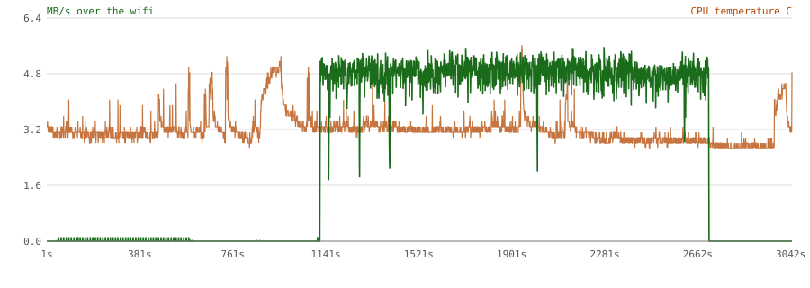

# Transfer over the hotspot: 6.3 GB folder, 68153 files, machine to machine

Measured 2026-08-25 16:20:39, interface `Gorilla.WIFI`, sampled every second from the kernel's
own counters. The hub reports nothing here about itself.

## What moved

| | |
|---|---|
| bytes carried | **7,560,168,427** (7.56 GB) |
| duration | 2976 s (49.6 min) |
| seconds actually moving data | 1626 of 2943 |
| mean while moving | **4.65 MB/s** |
| standard deviation | 0.91 MB/s |
| slowest second | 0.11 MB/s |
| fastest second | 5.64 MB/s |

## Was the radio healthy

| | |
|---|---|
| frames sent | 4,936,420 |
| wifi retries | 92,427  (1.87% of frames) |
| wifi frames given up on | 91 |
| interface errors | 0 |
| interface drops | 4 |
| signal | -42 dBm mean, -64 worst |
| negotiated rate | 68 Mbit/s mean, 1 worst |
| TCP segments | 1,933,102 |
| TCP retransmissions | 5,930 (**0.3068%**) |

A retry is a frame the radio had to send again. The rate matters more
than the total: a link can hold its throughput while retransmitting
heavily, and that is the state that collapses when another device joins.

## What it cost the laptop

| | |
|---|---|
| CPU temperature | 52 C start, 66 C peak |
| CPU busy | 4% mean, 52% peak |
| fan | 27% mean, 38% peak |
| thermal throttling | **none** |

Raw per-second samples: `transfer-26-08-25-16-20.csv`

Packet headers (96-byte snaplen, no payload): `capture-26-08-25-16-20/`
