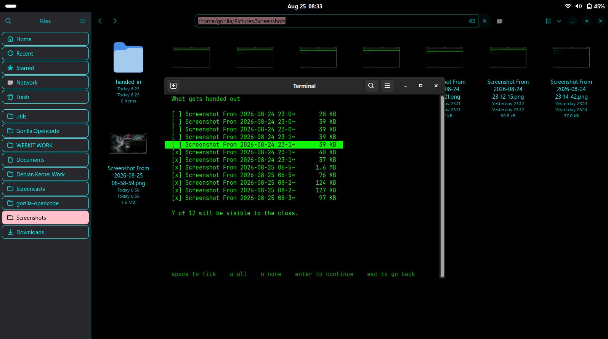
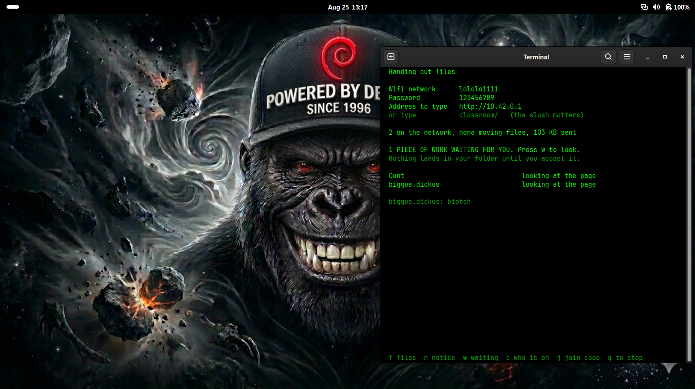
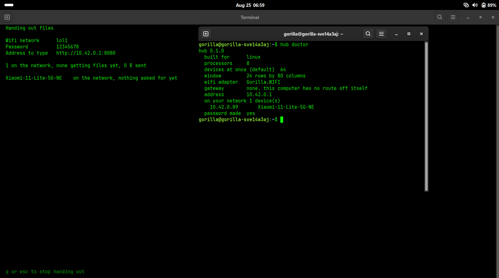

# How to use the hub

This guide is for the person standing at the front of the room. You do not need
to know what a terminal is, and you do not need to install anything on the
children's phones.

Every picture is a real screen. Click any of them to see it full size.

---

## What this is

Your laptop becomes the wifi network. The class joins it, their phones open a
page by themselves, and that page holds the files you are handing out. They send
their work back the same way.

Nothing here needs the internet. Nothing here needs a router. The children
install nothing and sign in to nothing.

**Three things you get:**

- Files go out to every device at once, and a device that loses the signal
  carries on from where it stopped.
- Work comes back to you, and waits for you to accept it before it lands on
  your computer.
- You can see who is on the network, by name, and take somebody off it.

---

## Before you start

You need one of these:

| You have | You get |
|---|---|
| A laptop running Debian, Ubuntu, Mint or similar | Everything, including making the wifi network |
| A laptop running Arch, CachyOS or Manjaro | Everything, including making the wifi network |
| A laptop running Windows | Everything except making the network. You switch the hotspot on in Windows first |

You also need the children's devices to have a web browser. Any browser, going
back to about 2009. That is the whole requirement on their side.

---

## Install it

### On Debian, Ubuntu or Mint

1. Download `gorilla-portable-network-hub_0.9.5_amd64.deb` from the releases
   page.
2. Open a terminal in the folder you downloaded it to, and type:

```bash
sudo dpkg -i gorilla-portable-network-hub_0.9.5_amd64.deb
```

- **Pass:** the last line says `Setting up gorilla-portable-network-hub`.
- **Fail:** if it complains about a missing `libc6`, your system is older than
  this build. Tell us which version you have.

3. Check it arrived:

```bash
hub --version
```

- **Pass:** it prints `hub 0.9.5`.

### On Arch, CachyOS or Manjaro

Download the `.pkg.tar.zst` from the releases page and install it:

```bash
sudo pacman -U gorilla-portable-network-hub-0.9.5-1-x86_64.pkg.tar.zst
```

Or build it yourself, which needs the `rust` package:

```bash
git clone https://github.com/gorillanobakaa-dot/Gorilla.Portable.Network.Hub
cd Gorilla.Portable.Network.Hub/packaging
makepkg -si
```

- **Pass:** `hub --version` prints `hub 0.9.5`.

### On Windows

1. Download `hub-0.9.5-windows-x86_64.zip` and unzip it anywhere.
2. Switch the hotspot on yourself: **Settings**, then **Network and internet**,
   then **Mobile hotspot**. Write down the network name and password Windows
   shows you.
3. Double-click `hub.exe`.

- **Pass:** a screen appears offering *Hand out files to the class*.
- **Fail:** Windows may warn that it does not recognise the program. That
  warning appears for any program without a paid signing certificate. Choose
  **More info**, then **Run anyway**, or do not run it. Both are reasonable.

---

## Hand out files to the class

This is the main job. Five steps.

1. Put the files you want to hand out in one folder. Anything in it can be
   offered to the class; you choose which in step 4.

2. Start the program. Type `hub` in a terminal, or find **Gorilla Portable
   Network Hub** in your applications menu.

3. Choose *Hand out files to the class*, then fill in the form.

   - **Folder to hand out** is the folder from step 1. Press `Tab` while typing
     a path and it completes the rest, the way a terminal does.
   - **Wifi network to make** is the name the class will look for. Leave it
     empty if the class is already on the same wifi as you.
   - **Password for it** is filled in for you. Change it if you like. It must
     be at least eight characters, which is a rule of wifi itself.
   - **Wifi channel** is which of the wifi lanes the network broadcasts on.
     Leave it on automatic unless the room is slow. Channels are lanes on the
     same road: a crowded lane looks fine from the front of the room, it is
     just slow. If a lesson that used to be quick has gone sluggish, try
     another lane; the screen lists which ones your laptop, in your country,
     is allowed to use. One radio can only use one lane at a time, so there is
     no setting that uses them all. If a device cannot find the network at
     all, use 11 or lower: some phones with American radios cannot see lanes
     12 and 13.
   - **Connections to serve at once** is how many requests the laptop will
     answer simultaneously. Leave it alone unless you are testing. One device
     holds several connections at a time: a phone's browser opens about six,
     and this tool's own downloads use four, so thirty phones is nearer 180
     connections than 30.

   On the receiving machine there is a matching setting, **Connections per
   file**, which defaults to four. More is not faster: the limit is airtime,
   and the measured peak is the same at every value from one to 32. See
   [bench/RESULTS.md](../bench/RESULTS.md).

4. Tick the files the class may see.

   [](screenshots/gallery/tick-list-live-on-real-folder.png)

   Putting a file in the folder does not publish it. Ticking it does. An
   unticked file cannot be reached even by a child who guesses its name.

   Press `space` to tick one, `a` for all, `n` for none, then `Enter`.

   **Folders inside your folder are included.** If your folder has subjects in
   it, or weeks, or a resource pack exactly as you downloaded it, all of it is
   handed out and the list shows the path of each file. You do not have to
   flatten anything first.

   The class page shows the first 300 files and says how many more there are.
   Another computer running this tool sees all of them.

   The page also carries one purple button: **GET EVERYTHING**. It hands the
   whole folder over as a single download that Windows opens like a folder,
   with nothing installed. The files inside are not compressed, so it costs
   the teacher's laptop almost nothing to produce; it is the files laid end
   to end with a table of contents. The download shows a real progress bar
   with an end, and if it fails partway it starts again from the beginning,
   which is the one way it is weaker than this tool's own resume.

5. Read the network name and password out to the class, or write them on the
   board.

   [](screenshots/gallery/roster-two-devices-and-work-waiting.png)

- **Pass:** the screen says *Handing out files* and shows a wifi name, a
  password and an address.
- **Fail:** if it says this computer will not let a normal account create a
  network, close it and start it again with `sudo hub`.

### What the address means

The screen shows an address like `http://10.42.0.1`. If it has no `:8080` on
the end, phones will open the class page **by themselves** and nobody needs to
type anything.

If it does show `:8080`, something else on your computer has taken the page
that phones look for. The class can still get in by typing the address with
`:8080` on the end. The screen tells you when this happens.

---

## What the children do

Nothing, mostly.

1. They join the wifi network you named, using the password you read out.
2. Their phone puts up a *Sign in to network* screen by itself, and that screen
   is the class page.

If a phone does not do that, tell them to open a browser and type:

```
classroom/
```

The slash at the end matters. Without it, the browser searches the internet for
the word instead of looking on your network. `class/`, `lesson/`, `school/` and
`hub/` all work too.

### The page they see

[](screenshots/gallery/phone-handed-in-confirmation.jpeg)

The first thing the page asks is their name. That is deliberate: thirty
identical phones are impossible to tell apart, and everything they send is filed
under the name they type.

Then they get **READ** to look at a file without downloading it, and **GET IT**
to keep a copy.

---

## Send a folder down a cable

Wifi is not always the answer. A staffroom at four o'clock has thirty phones
and a microwave on the same slice of radio. Some laptops have a wifi card that
died years ago. Thirty gigabytes of video over old wifi takes an afternoon.

An ordinary network cable between two laptops has none of those problems. It is
the rectangular-plug cable that normally goes into a wall socket, it costs about
two pounds, and on most laptops made since about 2005 you do not need a special
"crossover" one. No router, no wifi and no internet are involved at all.

### What to do

1. Plug the cable into both laptops. A small light next to the socket comes on
   at each end. If neither light comes on, the cable or a socket is faulty.

2. **Wait about thirty seconds before doing anything else.** Both computers
   have to give up waiting for a router that is not there and settle on an
   address of their own. This is the step people skip, and skipping it is the
   commonest reason the next step says it found nothing.

3. On the computer that has the files, either open the screen and choose
   **Send files down a cable to one other computer**, or type:

   ```
   hub cable ~/lessons
   ```

4. It prints what it is doing, and a name: **gorilla.local**

5. On the other computer, open any web browser and type:

   ```
   gorilla.local
   ```

   That is the whole thing. No numbers, no dots to get right. Some computers
   will offer to open the page by themselves, the same way a hotel wifi does,
   in which case there is nothing to type at all.

   If the name does not work, the address it printed always will. And if you
   would rather run the program on the second computer too:

   ```
   hub cable-get
   ```

   Nothing needs typing. The sending computer says where it is once a second,
   and this listens for it.

That is the whole procedure. If you would rather not run anything on the second
computer, open the `http://169.254...` address the sender printed in any web
browser instead. The page is the same one the class sees over wifi.

### If the other computer runs Linux

This is the case that used to fail completely, and it is worth knowing why so
you can recognise it.

When there is no router, Windows and Mac wait 30 to 60 seconds, give up, and
give themselves an address. Most Linux systems are set to "Automatic (DHCP)",
which means they wait for a router to give them one. On a bare cable no router
ever answers, so they wait forever. The network connection never comes up and
nothing you do at the other end can help.

From this version the sending computer answers that question itself. The Linux
laptop gets an address in about half a second and the cable starts working. You
do not have to do anything, and you do not have to set a static IP address by
hand.

One limitation, stated plainly: if the computer **sending** is itself running
Linux or macOS, giving out addresses needs administrator rights, because the
part of the network it uses is reserved. Run it with `sudo` if the far end is
also Linux. Sending from Windows is not affected. The program tells you which
situation you are in rather than failing quietly.

### What it will not do

It will not hand out addresses on a network that already has a router. That is
deliberate, and it is the most important safety rule in this feature. Two
things handing out addresses on one school network fight each other and can
take every computer in the building off the network, not just yours. The
program checks before it does anything and refuses if it sees a router.

If you ever see it say it is giving out addresses while you are plugged into a
school or office network rather than a bare cable between two laptops, stop it
and tell us. That would mean the check was wrong, and we would want to know
that day.

### How fast it should be

The program reads the speed the two network cards agreed on and sizes its work
to match. You can see what it decided:

```
hub doctor
```

The `cable` line names your adapter and its speed. Roughly what to expect:

| What the cable and sockets support | Realistic speed | 10 GB takes about |
| :--- | :--- | :--- |
| 100 Mbps (older laptops, CAT 5) | 11 MB/s | 15 minutes |
| 1 Gbps (most laptops since 2010) | 110 MB/s | 90 seconds |

Both ends have to support the higher speed. One old laptop in the pair sets the
speed for both.

## Get a whole folder onto another computer

On the receiving machine, choose *Get files from another computer*, then:

- `Enter` gets the one file you have highlighted.
- **`a` gets every file on the list**, folders and all, rebuilding the folder
  structure as it goes.

- **Pass:** the screen says *Getting a folder* and counts `file 12 of 340`.
- **Fail:** files that did not arrive are listed by name at the bottom. Run it
  again and it picks up only those.

Two settings control how it fetches, and they solve different problems.

- **Connections per file** (default four) splits one big file into pieces
  fetched side by side. This is what keeps a large file moving.
- **Files at the same time** (default four) keeps several files in the air at
  once. This is what matters when the folder is thousands of small files: each
  file costs a request-and-wait, and while one file's request is in the air the
  radio would otherwise sit idle.

The defaults are sensible for a mixed folder. Turning either up does not make
the radio faster; the ceiling is airtime, and it is the same at every setting.

## Collect work from the class

The class page has *Hand in your work*. They can pick more than one file at a
time, which matters because an assignment is rarely one file.

Nothing they send lands on your computer straight away. It waits.

1. The roster tells you: `1 PIECE OF WORK WAITING FOR YOU. Press w to look.`
2. Press `w`.
3. For each piece, press `a` to accept it, `r` to refuse it, or `o` to open and
   look at it first.

- **Pass:** accepted work appears in a `handed-in` folder inside the folder you
  are handing out.
- **Fail:** if the screen says hand-in is off, the folder cannot be written to.
  A USB drive that is full, write-locked or unplugged is the usual reason.

Refused work is **kept**, in a `refused` folder. It is not deleted. If a child
sends something they should not have, that file is evidence and it is not this
program's place to destroy it.

Nothing sent to you is ever handed back out to the class, not even while it is
waiting.

### Knowing who sent what

Every note and every file is filed with three things: the name the child typed,
what the device is, and a short tag like `#nzrm` derived from the hardware.

```
26-08-25 11:37  County.Cunt #cyyr [Xiaomi-11-Lite-5G-NE, 10.42.0.183]: ...
```

The name can be typed by anyone. The tag cannot. If two devices claim the same
name, the roster tells you so rather than leaving you to work it out.

---

## Put a message on every screen

Press `n` on the roster, type your message, press `Enter`.

It appears at the top of every child's page, in a yellow box, within about ten
seconds. It is the blackboard, copied onto thirty screens.

---

## Take a device off the network

Press `c` for *Who is on the network*.

[](screenshots/gallery/class-screen-two-devices-and-the-limits.png)

There are two ways to remove somebody and they are not the same thing.

### Pause one device

Move to the name with the arrow keys and press `space`.

That device keeps the wifi and loses the lesson. It cannot get the files, cannot
hand anything in, cannot send you a note, and cannot reach the file list by
guessing a name. It sees a page saying you paused it, with nothing to press.

Press `space` again to let them back in. **The child does not have to do
anything**: their page comes back on its own within about fifteen seconds.

**What a pause is not:** it is not a lock. It recognises the device, and a phone
can be told to present itself differently. A child who works that out is back
under a new name. The screen says so, because finding this out from a child in
front of a class is worse than being told.

### Change the wifi password

Press `p`, then `Enter`.

Everybody in the room is knocked off at once. Only the people you give the new
password to come back. This is the answer when a pause is not holding.

It is blunt, and the screen warns you before it runs: thirty children retyping a
password to remove one costs you part of a lesson.

Paused devices stay paused through a password change. The child you paused is
the likeliest to get the new password from a friend.

---

## Let a phone join by camera

Press `j`. The screen draws a square a phone camera can read, and pointing a
camera at it offers to join the network with no typing.

The network name and password stay printed above it at the same size, on
purpose. Plenty of these phones have a cracked camera, or a camera app that
wants an account before it will scan. **The code is a shortcut for some of the
room, never the way in for all of it.**

If the window is too small to draw the code properly, the screen says so and
draws nothing. A partly drawn code does not scan.

---

## When the lesson ends

Press `q` or `Esc`.

Your own wifi comes back the way it was. If the program is killed outright, or
the battery dies, or somebody closes the terminal, your wifi still comes back
within three minutes: the operating system holds that promise, not the program.

---

## If something does not work

| What you see | Why | What to do |
|---|---|---|
| Phone says the network has no internet, and nothing opens | Correct. There is no internet, on purpose | Tell them to open a browser and type `classroom/` with the slash |
| A phone joins but never appears on your roster | It has not opened the page yet | The roster says so in words. Nothing is wrong |
| The address on screen ends in `:8080` | Another program on your laptop holds the page phones look for | Close that program, or tell the class to type the address including `:8080` |
| `This computer will not let a normal account create a network` | Making a wifi network needs administrator rights | Close it and start again with `sudo hub` |
| `This wifi adapter cannot create a network, only join one` | Some adapters are built that way. Nothing is broken | Use a phone hotspot instead, and leave the network name empty |
| A name shows as a number like `10.42.0.251` | That device told the network nothing about itself. Laptops often do not | Fixed in 0.8.0, which reads it from the browser instead. Check `hub --version` |
| Hand-in is off | The folder cannot be written to | Check the USB drive is plugged in, has room, and is not write-protected |
| The window is too small | The screen needs room to draw | Make the terminal window bigger, or press `Esc` and use the printed password |

If none of these match, run:

```bash
hub doctor
```

[](screenshots/gallery/hub-doctor-output.png)

It says what it found and what it did not. Send us that output and we can
usually tell you what is happening.

---

## What it does not do

Stated plainly, because finding out in a lesson is worse.

- **It is not the internet.** There is no web, no email, no search. It moves
  files between machines in one room.
- **A pause is not a lock.** See above. The password is the control that cannot
  be walked around.
- **It does not encrypt what is on your disk.** Work children hand in is a
  normal file in a normal folder on your laptop.
- **The wifi password is the only thing protecting the network.** Anyone in
  radio range who has it can join. Write it on the board and change it between
  classes if that matters to you.
- **On Windows it cannot create the network**, only serve over one you have
  already created.

---

## Tell us how it went

This is a new tool and it has been used in one room, by one person, on one
morning. Anything you tell us is worth more than anything we can guess.

Open an issue at
<https://github.com/gorillanobakaa-dot/Gorilla.Portable.Network.Hub/issues>.

The three things that help most:

1. **What kind of laptop, and what it runs.** The output of `hub doctor` covers
   most of this.
2. **What kind of phones the children have.** Especially old ones, and
   especially ones that failed.
3. **What you expected to happen, and what happened instead.** In your own
   words. You do not need to know why.

You do not need to be technical to file a useful report. "Nine phones connected
and three did not, all three were the same cheap Android" is a better bug report
than most.
