# How to use the hub, step by step

This guide is for the person standing at the front of the room. You do not
need to know what a terminal is, and you do not need to install anything on the
children's phones. It describes **version 0.9.9**.

Every picture is a real screen. Click any of them to see it full size. The
pictures of Windows use a made-up teacher's folder and a made-up password.

---

## What this is

Your laptop becomes the wifi network. The class joins it, their phones open a
page by themselves, and that page holds the files you are handing out. They
send their work back the same way.

Nothing here needs the internet. Nothing here needs a router. The children
install nothing and sign in to nothing.

**What you get:**

- Files go out to every device at once, and a device that loses the signal
  carries on from where it stopped.
- Work comes back to you, waits until you accept it, and then lands in one
  folder you can find.
- You can see who is on the network, by name, and take somebody off it.

---

## What you need

| You have | You get |
|---|---|
| A laptop running **Windows 10 or 11** | Everything. From 0.9.9 the hub makes the wifi network itself |
| A laptop running Debian, Ubuntu, Mint or similar | Everything |
| A laptop running Arch, CachyOS or Manjaro | Everything |

The children's devices only need a web browser. Any browser, going back to
about 2009. That is the whole requirement on their side.

The laptop's **wifi must be switched on** (it does not need to be connected to
anything). The wifi network is broadcast by the laptop's wifi card, so with
wifi switched off there is nothing to broadcast from.

---

## Part 1: Get it running

### On Windows

1. Go to the
   [releases page](https://github.com/gorillanobakaa-dot/Gorilla.Portable.Network.Hub/releases)
   and download `hub-0.9.9-windows-x86_64.zip`.
2. Right-click the zip and choose **Extract All**. Put it anywhere: a USB drive
   is fine.
3. Open the folder it made and double-click **hub.exe**.
4. Windows may say it does not recognise the program. That warning appears for
   any program without a paid signing certificate. Choose **More info**, then
   **Run anyway**, or do not run it. Both are reasonable.

The first screen appears. The top line says `Gorilla Portable Network Hub 0.9.9`
and the date the program was built. (In a terminal, `hub --version` prints
`hub 0.9.9` and the same date.)

[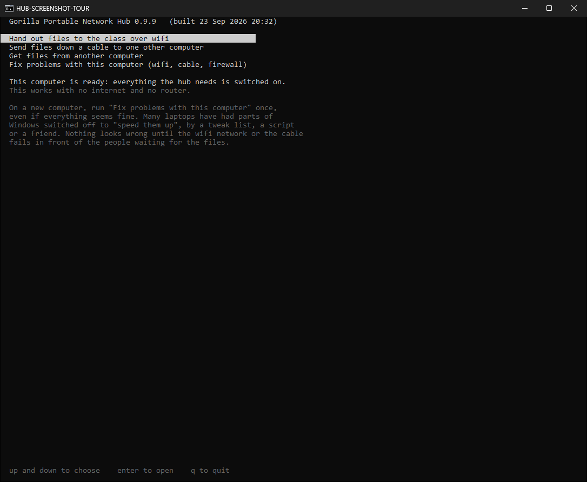](screenshots/gallery/windows-0.9.9-first-screen.png)

Use the **up and down arrow keys** to choose, and **Enter** to open. **q**
quits.

### If it says THIS COMPUTER IS NOT READY YET

Many laptops, especially second-hand ones, have had parts of Windows switched
off to "speed them up". Nothing looks wrong until the wifi network fails in
front of the class. The hub checks as soon as it opens, and tells you.

[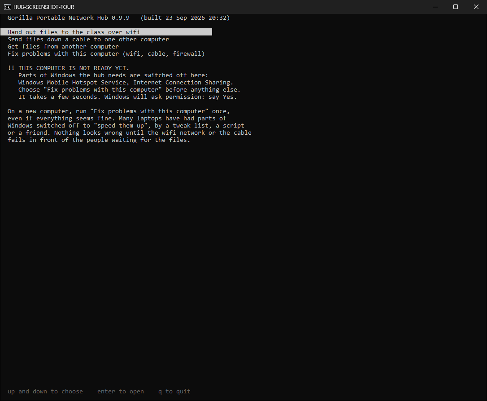](screenshots/gallery/windows-0.9.9-not-ready.png)

**What to do:** choose **Fix problems with this computer**, then **Turn on the
parts of Windows the hub needs**, and press Enter. If you choose *Hand out
files* first, the hub stops you and offers the same fix:

[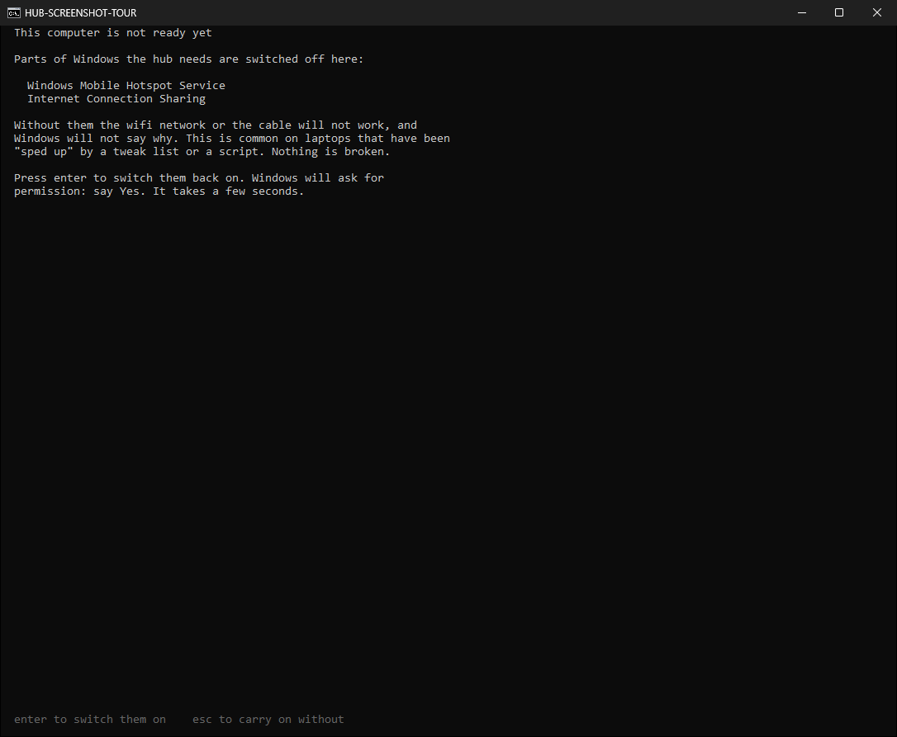](screenshots/gallery/windows-0.9.9-fix-offer.png)

Windows asks for permission. **Say Yes.** A few seconds later:

[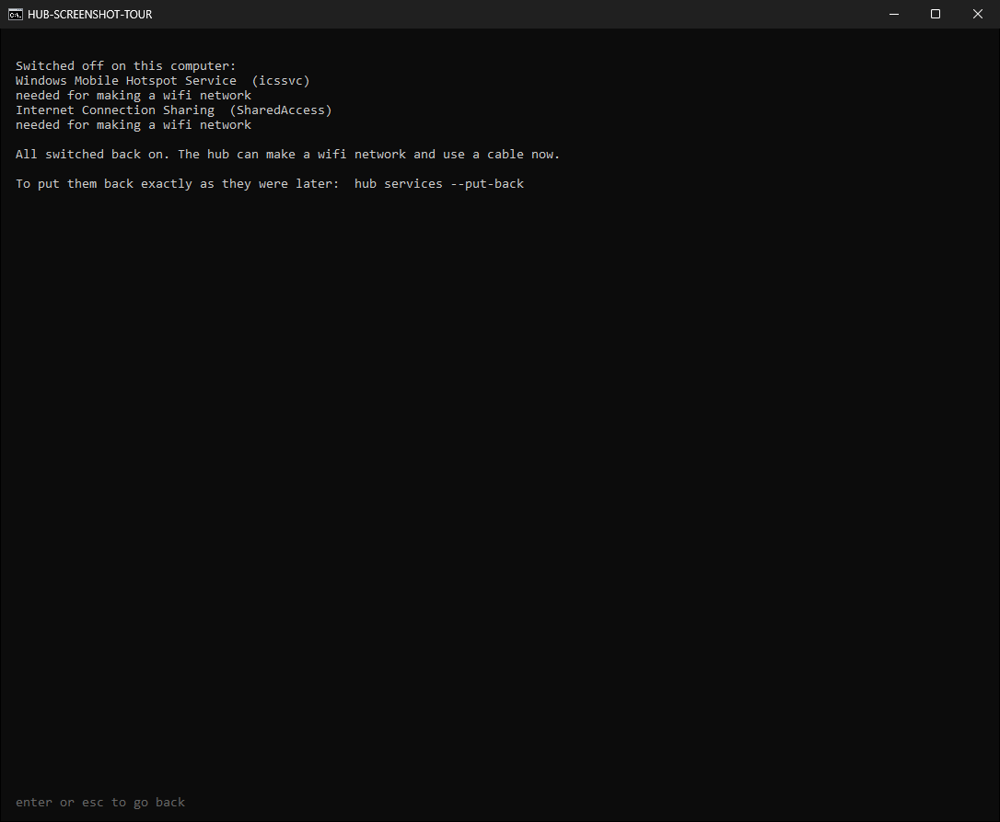](screenshots/gallery/windows-0.9.9-fix-done.png)

That is all. Nothing is installed or removed: the parts are set back to what
Windows itself ships with. The hub writes down how they were first, so they can
be put back exactly (see *For the person who looks after the laptop* near the
end).

If Windows asks for an **administrator password you do not have**, the laptop
belongs to somebody else (a school, an employer) and they have to do it. Until
then, use a cable instead: see Part 7. It needs none of this.

### The Fix problems screen

You can open it any time. It says, in one line each, whether the parts of
Windows the hub needs are on, whether the firewall has been opened for the hub,
and **what this laptop's wifi card can do**, read from the card itself.

[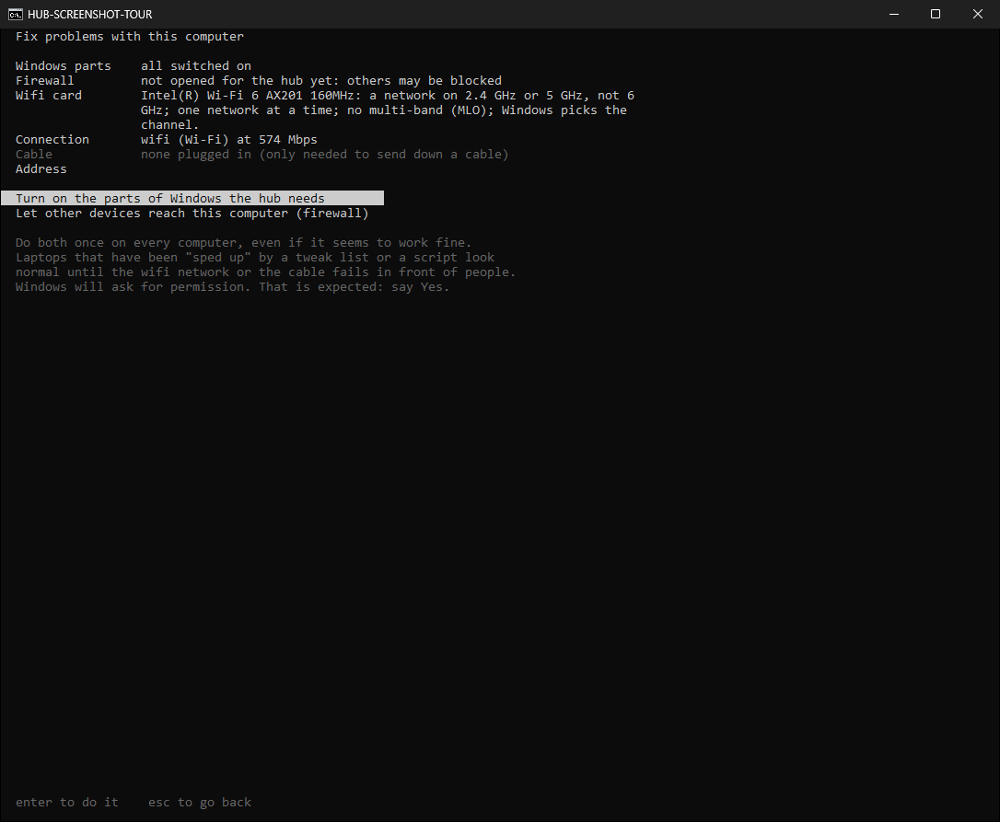](screenshots/gallery/windows-0.9.9-fix-problems.png)

Do **both** buttons once on every new laptop, even if it seems to work fine:

- **Turn on the parts of Windows the hub needs** (explained above).
- **Let other devices reach this computer (firewall).** If Windows asks when
  you first hand out files whether to let the hub through its firewall, say
  **Allow** as well.

### On Linux

The newest Linux packages are **0.9.5**; the Linux build of 0.9.9 is being
tested. 0.9.5 works as described here, except where this guide says *Windows*.

On Debian, Ubuntu or Mint, download `gorilla-portable-network-hub_0.9.5_amd64.deb`
from the releases page, open a terminal in that folder, and type:

```bash
sudo dpkg -i gorilla-portable-network-hub_0.9.5_amd64.deb
```

On Arch, CachyOS or Manjaro:

```bash
sudo pacman -U gorilla-portable-network-hub-0.9.5-1-x86_64.pkg.tar.zst
```

Then find **Portable Network Hub** in your applications menu, or type `hub`.

---

## Part 2: Hand out files over wifi

### Step 1: put the files in one folder

Anything in it can be offered to the class. Folders inside it are included,
exactly as they are: subjects, weeks, a resource pack as you downloaded it.
You choose what the class may actually see in step 4.

### Step 2: choose *Hand out files to the class over wifi*

The start screen appears.

[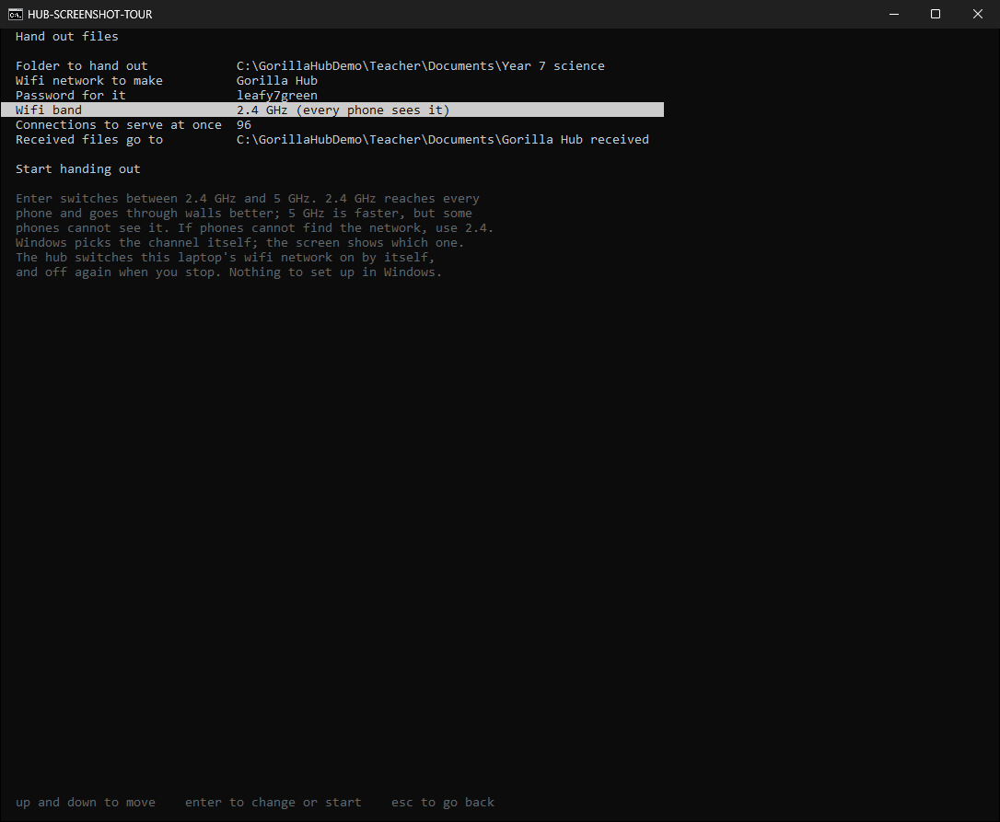](screenshots/gallery/windows-0.9.9-start-screen-band.png)

Move with the **up and down arrows**, press **Enter** to change a line.

| Line | What it means | What to do |
|---|---|---|
| **Folder to hand out** | The folder from step 1 | Enter opens a folder browser: move to your folder, open it with Enter, then choose the line at the top |
| **Wifi network to make** | The name the class looks for | *Gorilla Hub* is ready. Change it if you like |
| **Password for it** | The wifi password | Filled in for you. At least 8 letters, a rule of wifi itself. The same name keeps the same password next time, so phones that joined before join again without asking |
| **Wifi band** (Windows) | Which radio band the network uses | Leave it on **2.4 GHz**: every phone sees it and it goes through walls better. Enter switches to 5 GHz, which is faster but some phones cannot see at all |
| **Wifi channel** (Linux) | Which lane the network uses | Leave it on automatic. If the room is slow, try 11 or 13 |
| **Connections to serve at once** | How many requests at the same time | Leave it alone |
| **Received files go to** | The folder children's work goes into | *Documents\Gorilla Hub received*. Enter lets you choose another folder |

### Step 3: choose *Start handing out*

### Step 4: choose what the class may see

The list shows **one folder at a time**: the folders inside it with how many
files each holds, then its own files.

[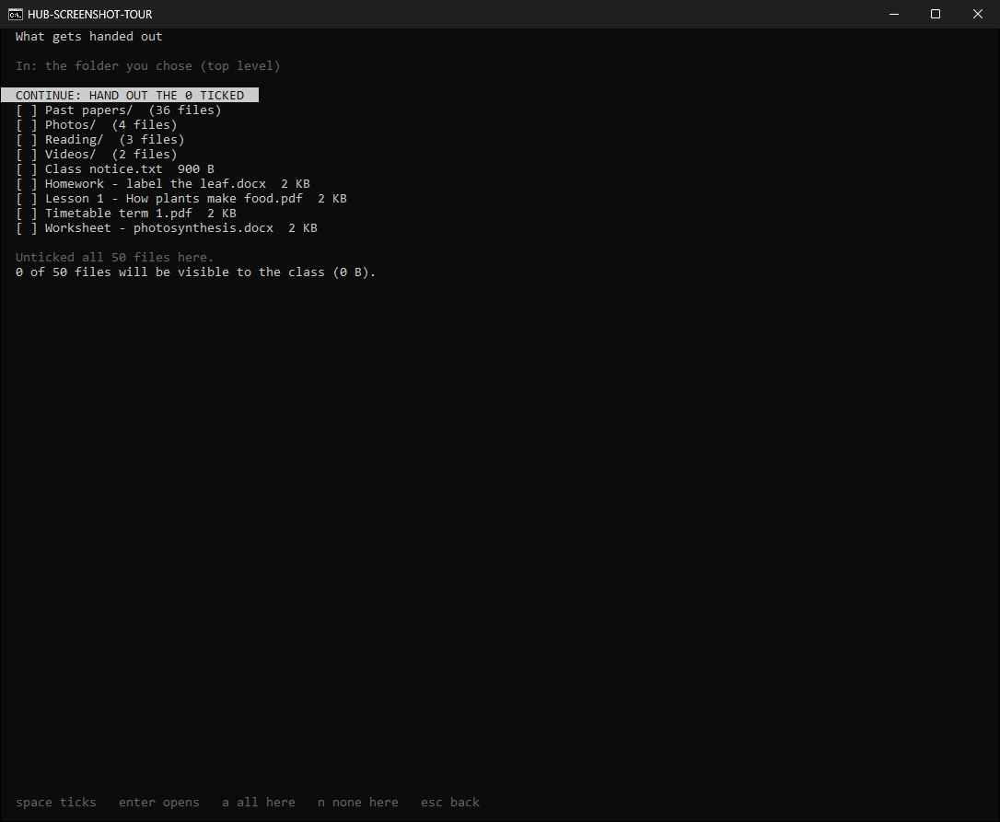](screenshots/gallery/windows-0.9.9-folder-view.png)

- **Space** ticks or unticks what the cursor is on. `[x]` means handed out,
  `[ ]` means not, `[~]` means some of the files inside a folder.
- **Enter** on a folder goes inside it, so you can tick single files.
  **Backspace** (or the `..` line) comes back out.
- **a** ticks everything in the folder you are looking at, **n** unticks it.
- **Page Down / Page Up**, and the arrow keys, move through a long list. If it
  does not all fit, the bottom of the list says how many there are and which
  key shows the rest. A wide window shows several columns.

**A big folder asks first.** Ticking a folder with many files, which could be
thousands, stops and says exactly how many:

[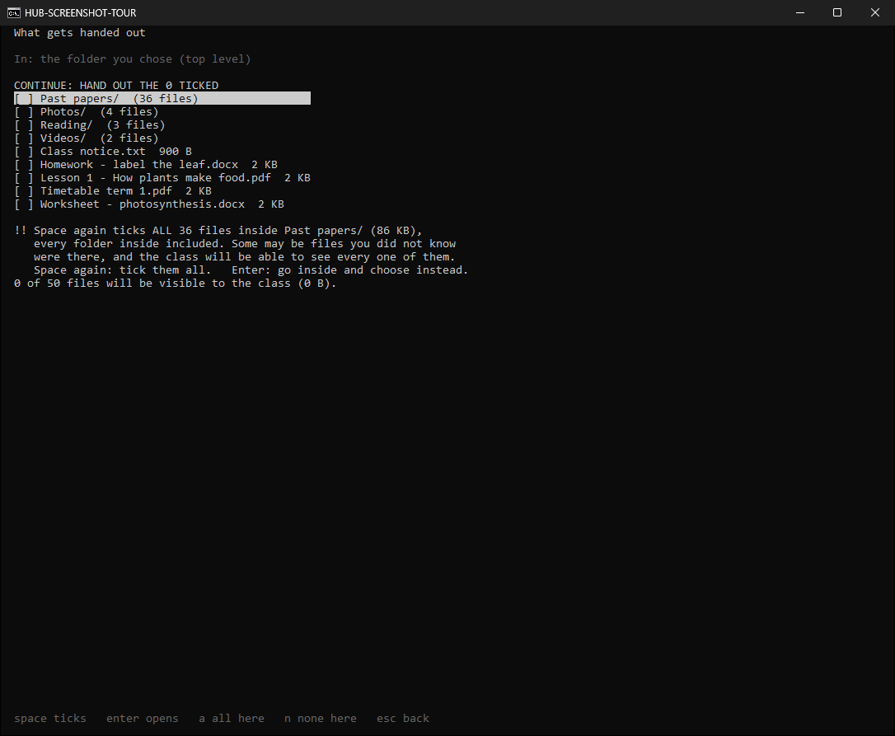](screenshots/gallery/windows-0.9.9-big-folder-question.png)

Press **space again** to tick them all, or **Enter** to go inside and choose.
Any other key cancels.

**Putting a file in the folder does not publish it. Ticking it does.** An
unticked file cannot be reached, even by a child who guesses its name.

When you are happy, go up to **CONTINUE: HAND OUT THE … TICKED** at the top and
press Enter.

### Step 5: the network comes up

On Windows the hub switches the wifi network on itself, a few seconds, no
Settings, no administrator. The screen shows everything the class needs:

[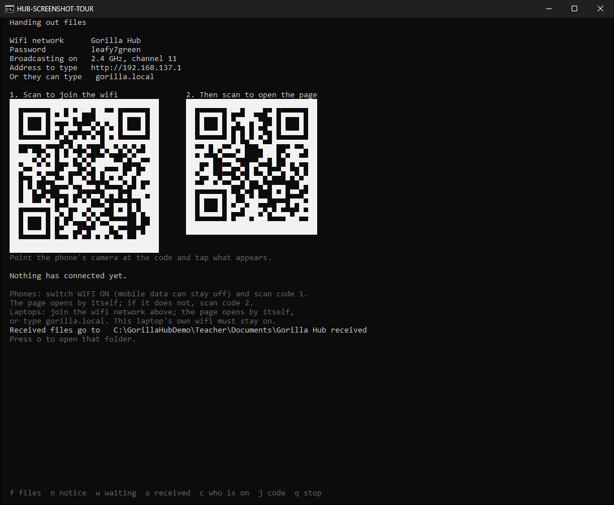](screenshots/gallery/windows-0.9.9-handing-out-codes.png)

- **Wifi network** and **Password**: read them out or write them on the board.
- **Broadcasting on**: the band and channel the laptop is really using, read
  from the wifi card.
- **Code 1** joins a phone to the network, password and all, when its camera is
  pointed at it. **Code 2** opens the class page.
- **Received files go to**: where the children's work will be. **o** opens it.

If the network goes off for any reason (Windows switches it off when the last
phone leaves; somebody switches the laptop's wifi off), the hub notices within
seconds, switches it back on, and says so on this screen while it does.

---

## Part 3: What the children do

1. **Switch wifi on** on the phone (mobile data can stay off).
2. **Scan code 1** with the phone's camera and tap what appears, or choose the
   network by name in the phone's wifi list and type the password.
3. The phone shows **Sign in to network** by itself and opens the class page.
   If it does not, **scan code 2**. On a laptop, type `gorilla.local` in the
   browser.

The first thing the page asks is their **name**, once. Everything they send is
filed under it: thirty identical phones are otherwise impossible to tell apart.

Then each file has **READ** (look at it now) and **GET IT** (keep a copy), and
there is one purple **GET EVERYTHING** button for the whole lot at once.

### Handing work in

Under *Hand in your work*, **Choose Files** opens the phone's own file picker.
They can choose several at once, and choose again to add more. Every chosen
file is listed with a red **REMOVE** button, so a wrong picture can be taken
back before sending. **START AGAIN** clears the lot.

[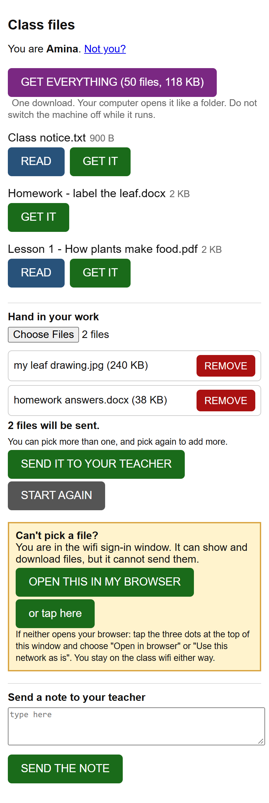](screenshots/gallery/phone-0.9.9-choose-and-remove.png)

Then **SEND IT TO YOUR TEACHER**. They can also **send you a note**.

If the phone opened the page in its small "sign in" window and *Choose Files*
does nothing, the page says so and offers a button to open it in the phone's
real browser.

---

## Part 4: Collect the work

Nothing a child sends lands on your computer straight away. It waits, and the
handing-out screen tells you:

[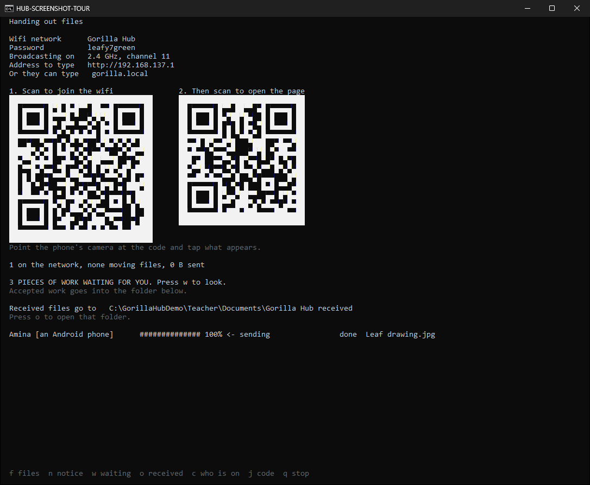](screenshots/gallery/windows-0.9.9-work-arrived.png)

Press **w**.

[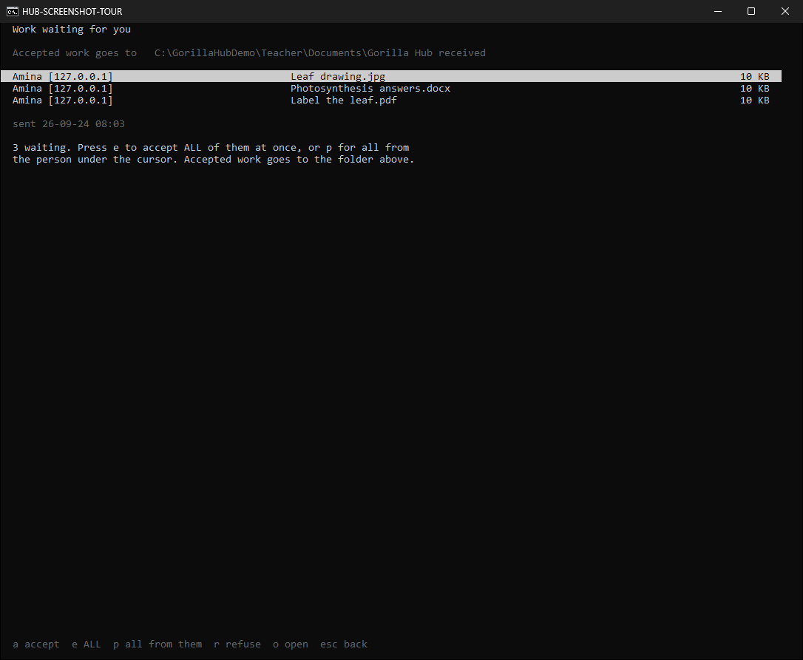](screenshots/gallery/windows-0.9.9-waiting-accept-all.png)

| Key | Does |
|---|---|
| **e** | **Accept everything waiting**, all at once. Forty children with six pieces each is one key, not 240 |
| **p** | Accept everything from the **person** under the cursor |
| **a** | Accept just the one under the cursor |
| **r** | Refuse it. Refused work is **kept** in a *refused* folder, never deleted: it may be evidence |
| **o** | Open it and look first |

[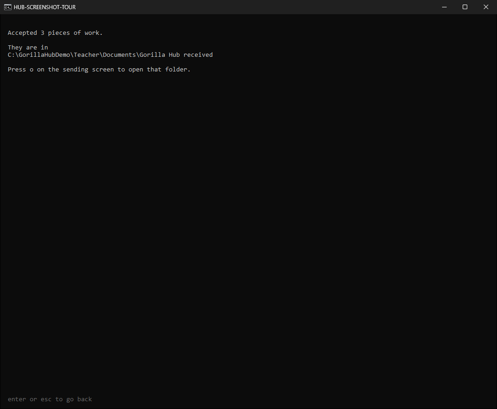](screenshots/gallery/windows-0.9.9-accepted-all.png)

Accepted work is in **Documents\Gorilla Hub received** (or the folder you chose
on the start screen). On the handing-out screen, **o** opens that folder.
Nothing sent to you is ever handed back out to the class.

Every piece is filed with the name the child typed, what the device is, and a
short tag from the hardware, for example `Amina #wa3x [an Android phone]`. The
name can be typed by anyone; the tag cannot. If two devices claim the same
name, the screen tells you.

---

## Part 5: During the lesson

All from the handing-out screen:

| Key | Does |
|---|---|
| **f** | Change which files are handed out, live: tick to publish now, untick to withdraw |
| **n** | Put a notice at the top of every child's page (the blackboard, on thirty screens) |
| **w** | Work waiting for you |
| **o** | Open the received folder |
| **c** | Who is on the network, by name |
| **j** | Show the join code on its own, larger |
| **q** | Stop handing out |

### Taking somebody off the network

Press **c**, move to the name, and:

- **Space** pauses that device: it keeps the wifi but loses the lesson. Space
  again lets it back; its page comes back by itself.
- **p** changes the wifi password. Everybody is knocked off at once, and only
  the people you give the new password to come back. Blunt, and the screen warns
  you first: use it when a pause is not holding.

A pause recognises a device, and a phone can be told to look like a different
one. The password is the control that cannot be walked around.

---

## Part 6: When the lesson ends

Press **q** to stop, **Enter** to close the message, then **q** again to quit.

The wifi network is switched off, and on Linux your own wifi comes back as it
was. If the window is closed with its **X**, or the program is ended any other
way, the network is still switched off within a few seconds by itself.

---

## Part 7: Send a folder down a cable

Wifi is not always the answer. Some laptops have a wifi card that died years
ago, and thirty gigabytes of video over old wifi takes an afternoon. An
ordinary network cable between two laptops has none of those problems. It is
the rectangular-plug cable that normally goes into a wall socket, it costs very
little, and on most laptops made since about 2005 you do not need a special
"crossover" one. No router, no wifi and no internet are involved.

1. Plug the cable into both laptops. A small light next to each socket comes on.
2. **Wait about thirty seconds.** Both computers have to give up waiting for a
   router that is not there and settle on an address of their own. Skipping this
   is the commonest reason the next step finds nothing.
3. On the computer with the files, choose **Send files down a cable to one
   other computer**.
4. On the other computer, open any web browser and type `gorilla.local`. Some
   computers offer to open the page by themselves. If the name does not work,
   the address the screen shows always will.

Or run the hub on the second computer too and choose **Get files from another
computer**: it finds the sender by itself.

**It will not hand out addresses on a network that already has a router.** Two
things handing out addresses on one school network can take every computer in
the building offline. The hub checks first, keeps checking, and stops if a
router appears.

| What the cable and sockets support | Realistic speed | 10 GB takes about |
| :--- | :--- | :--- |
| 100 Mbps (older laptops) | 11 MB/s | 15 minutes |
| 1 Gbps (most laptops since 2010) | 110 MB/s | 90 seconds |

---

## Part 8: Get a whole folder onto another computer

On the receiving laptop, run the hub and choose **Get files from another
computer**. It finds the teacher's laptop by itself.

- **Enter** gets the file you have highlighted.
- **a** gets every file on the list, rebuilding the folders as it goes.

Files that did not arrive are listed by name at the bottom; run it again and it
picks up only those.

---

## If something does not work

| What you see | Why | What to do |
|---|---|---|
| **THIS COMPUTER IS NOT READY YET** | Parts of Windows the hub needs are switched off | Part 1: *Fix problems with this computer*, say Yes |
| Phones cannot see the network at all | The band is 5 GHz and those phones cannot see it | Start screen: set **Wifi band** to 2.4 GHz |
| The network was seen, then vanished | The laptop's wifi was switched off, or Windows switched the network off | Leave the laptop's wifi on. The hub brings the network back by itself and says so |
| A phone cannot see *any* other wifi | That phone is sharing its own hotspot. Most phones cannot do both | Switch the phone's own hotspot off |
| The code does not scan | The camera cannot fit the code in, or the phone's camera app does not read codes | Step back, or use Google Lens; or join by name and password |
| The phone joined, but no page opened | Some phones do not show the sign-in page | Scan code 2, or type `gorilla.local` on a laptop |
| Typing `gorilla.local` on a phone does a web search | Phone browsers treat it as a search | Use code 2 instead |
| The address on screen ends in `:8080` | Another program on the laptop holds the page phones look for | Close that program, or tell the class to type the address with `:8080` |
| Hand-in is off | The received folder cannot be written to | Check the USB drive has room and is not write-protected, or choose another folder |
| The window is too small for the codes | The codes need room | Make the window bigger (maximise it), or press **j** |
| On Linux: *will not let a normal account create a network* | Making a network needs administrator rights there | Start it with `sudo hub` |

If none of these match, run `hub doctor` in a terminal (or look at *Fix problems
with this computer*) and send us what it says.

### For the person who looks after the laptop

- `hub services` lists the parts of Windows the hub needs that are switched off.
  `hub services --fix` switches them on (one permission prompt).
  `hub services --put-back` puts them back exactly as they were before the hub
  changed them.
- The hub writes what the wifi network did (switched on, went off, came back,
  and what Windows said each time) to `%LOCALAPPDATA%\PortableNetworkHub\network.log`,
  and any crash to `crash.log` in the same folder.
- By hand, the two parts are *Windows Mobile Hotspot Service* (`icssvc`) and
  *Internet Connection Sharing* (`SharedAccess`), set to Manual.

---

## What it does not do

- **It is not the internet.** No web, no email, no search. It moves files
  between machines in one room.
- **A pause is not a lock.** The password is the control that cannot be walked
  around.
- **The wifi password is the only thing protecting the network.** Anyone in
  radio range who has it can join. Change it between classes if that matters.
- **It does not encrypt what is on your disk.** Handed-in work is a normal file
  in a normal folder.
- **On Windows it cannot pick the exact channel.** Windows chooses the channel
  within the band; the screen shows which one.

---

## Every key, on one page

| Screen | Keys |
|---|---|
| Everywhere | **up/down arrows** move, **Enter** chooses, **Esc** goes back |
| First screen | **q** quits |
| Choosing files | **Space** tick/untick, **Enter** open a folder, **Backspace** out of it, **a** all here, **n** none here, **Page Up/Down**, **Home/End** |
| Handing out | **f** files, **n** notice, **w** work waiting, **o** received folder, **c** who is on, **j** join code, **q** stop |
| Work waiting | **e** accept all, **p** all from this person, **a** accept one, **r** refuse, **o** open |
| Who is on | **Space** pause/unpause, **p** new wifi password |

---

## Tell us how it went

Open an issue at
<https://github.com/gorillanobakaa-dot/Gorilla.Portable.Network.Hub/issues>.
You do not need to be technical. The three things that help most:

1. **What kind of laptop, and what it runs.** `hub doctor` covers most of this.
2. **What kind of phones the children have.** Especially old ones, and
   especially ones that failed.
3. **What you expected to happen, and what happened instead.** In your own
   words.

"Nine phones connected and three did not, all three were the same cheap
Android" is a better report than most.
